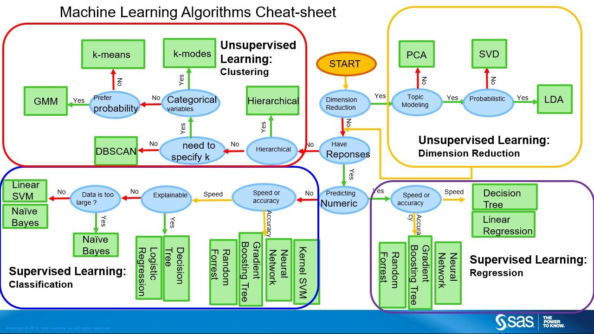

## Function

f(m, cf, oA, crit) =

Model:
Cost Function (cf): way of evaluating if the ML model is performing correctly
Optimization Algorithm (oA): Optimize the cost function after every iteration
Evaluation Criteria (crit):

## Types of Machine Learning

### Supervised Learning

### Unsupervised Learning

### Reinforced Learning
